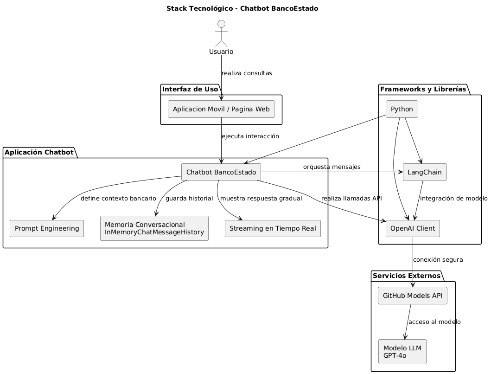

# Chatbot BancoEstado - Informe del Proyecto 

## 1. Introduccion

En el contexto actual de transformación digital, las instituciones financieras enfrentan el desafío de mejorar la atención al cliente mediante soluciones eficientes, rápidas y disponibles en todo momento. En este escenario, el uso de inteligencia artificial, específicamente modelos de lenguaje (LLM), se presenta como una alternativa innovadora para automatizar la interacción con los usuarios.

El presente proyecto tiene como objetivo el desarrollo de un chatbot inteligente orientado a la atención de clientes de BancoEstado, capaz de responder consultas frecuentes como:

- Cómo crear cuentas bancarias (CuentaRUT, cuenta de ahorro, cuenta corriente/vista)
- Cómo bloquear tarjetas en caso de pérdida o activarlas
- Cómo realizar transferencias
- Uso de servicios digitales (consultas de saldo, pagos en línea, uso de aplicaciones bancarias)

de manera clara, precisa y en tiempo real.

Para ello, se integran tecnologías como GitHub Models API y LangChain, junto con técnicas de Prompt Engineering, permitiendo construir un sistema conversacional con memoria, contexto y una experiencia de usuario mejorada.

Por ello, el chatbot busca:

- Automatizar respuestas a preguntas frecuentes
- Mejorar la disponibilidad del servicio (24/7)
- Reducir tiempos de espera
- Entregar información clara y accesible al usuario 

---

## 2. Problematica

Las instituciones financieras, como BancoEstado, enfrentan una alta demanda de consultas por parte de los usuarios, especialmente relacionadas con operaciones básicas, servicios digitales y gestión de productos bancarios. Esta situación genera una sobrecarga en los canales tradicionales de atención, como sucursales físicas, call centers y plataformas en línea.

Frente a este escenario, surge la necesidad de implementar soluciones basadas en inteligencia artificial que permitan optimizar la atención al cliente, mejorar la eficiencia operativa y ofrecer respuestas rápidas y accesibles en todo momento.

---

## 3. Implementación de la Solución

La solución fue desarrollada mediante la integración de distintas tecnologías abordadas durante el curso. Inicialmente, estas fueron implementadas en notebooks separados, para posteriormente ser unificadas en una sola estructura funcional. 
A partir de esta integración, se construyó un chatbot capaz de responder consultas de clientes de manera precisa, clara y amigable, utilizando modelos de lenguaje y herramientas especializadas para el manejo de conversaciones.

### 3.1 GitHub Models API

Se utilizó el cliente de OpenAI conectado a GitHub Models para realizar llamadas directas a modelos de lenguaje, permitiendo interactuar con el sistema de inteligencia artificial mediante una API. 

El uso de esta tecnología fue fundamental, ya que permitió integrar modelos avanzados como GPT-4o dentro de la aplicación, facilitando la generación de respuestas automáticas a partir de las consultas del usuario.

Esto permitió:
- Conectarse al modelo GPT-4o de manera segura mediante el uso de variables de entorno
- Configurar parámetros como "temperature" para controlar la creatividad de las respuestas
- Definir límites de respuesta mediante "max_tokens", optimizando el uso de recurso
- Obtener respuestas dinámicas en tiempo real desde una API externa

---

### 3.2 LangChain Model API

Se utilizó el framework LangChain como una capa de abstracción sobre el modelo de lenguaje, con el objetivo de facilitar la construcción de aplicaciones conversacionales más estructuradas y escalables.

El uso de LangChain permitió organizar de manera eficiente la interacción con el modelo, mediante el manejo de mensajes estructurados y el uso de roles (system, user, assistant), lo que contribuye a generar respuestas más coherentes y contextualizadas.

Esta herramienta facilitó:

- La creación de conversaciones "multi-turno", manteniendo el contexto entre interacciones 
- La integración de memoria conversacional para mejorar la continuidad del diálogo 
- La implementación de streaming, permitiendo respuestas en tiempo real

Esto permite construir aplicaciones más complejas de forma modular.

---

### 3.3 Streaming (Respuestas en Tiempo Real)

Se implementó la funcionalidad de streaming con el objetivo de mejorar la experiencia de usuario, permitiendo que las respuestas del modelo se generen y muestren de manera progresiva en tiempo real, en lugar de esperar a que la respuesta completa esté disponible.

Esta técnica permite simular un comportamiento más natural en el chatbot, similar al de una conversación humana, donde las respuestas se construyen de forma gradual.

Ventajas:
- Mejora la percepción de velocidad, ya que el usuario observa resultados de inmediato 
- Simula escritura en tiempo real y genera una experiencia más interactiva y dinámica
- Mantiene la atención del usuario durante la generación de la respuesta  

---

### 3.4 Memoria Conversacional

Se implementó memoria conversacional mediante el uso de InMemoryChatMessageHistory, con el objetivo de permitir que el chatbot mantenga el contexto a lo largo de múltiples interacciones con el usuario.

A diferencia de un sistema tradicional de preguntas y respuestas aisladas, la incorporación de memoria permite que el modelo recuerde mensajes anteriores, logrando una conversación más coherente, fluida y natural.

La funcionalidad permite:

- Mantener el contexto de la conversación entre distintas preguntas 
- Generar respuestas más precisas basadas en interacciones anteriores  
- Generar respuestas coherentes y simula un comportamiento más cercano a una conversación humana

Esto transforma el sistema en un chatbot más natural y no en un sistema de respuestas aisladas, capaz de adaptarse al flujo del diálogo y mejorar significativamente la experiencia del usuario.

---

## 4. Prompt Engineering (IL1.1)

En el desarrollo del chatbot se aplicaron técnicas de Prompt Engineering con el objetivo de mejorar la calidad, coherencia y seguridad de las respuestas generadas por el modelo de lenguaje.

En primer lugar, se utilizó la técnica de Zero-shot prompting, donde se define un mensaje de sistema que establece el rol del modelo como asistente virtual de BancoEstado, indicando claramente su propósito, tipo de respuestas esperadas, formato de salida y restricciones de seguridad.

Además, se incorporó la técnica de Few-shot prompting, mediante la inclusión de ejemplos de preguntas y respuestas relacionadas con el contexto bancario. Esto permitió mejorar la consistencia del modelo y guiar su comportamiento en consultas frecuentes como bloqueo de tarjetas o apertura de cuentas.

El prompt diseñado incluye:

- Definición de rol (asistente bancario)  
- Objetivo de respuesta (clara, breve y formal)
- Formato estructurado (respuesta, pasos, advertencias y canal oficial)
- Restricciones de seguridad (no solicitar datos sensibles)
- Uso del historial conversacional como contexto

Estas técnicas permiten que el chatbot genere respuestas más precisas, coherentes y alineadas al contexto del sistema, mejorando significativamente la experiencia del usuario.

---

## 5. Funcionalidades del Sistema 

- Chat interactivo en tiempo real  
- Respuestas con streaming  
- Memoria de conversación  
- Uso de modelo LLM (GPT-4o)  
- Contexto especializado en BancoEstado

## Diagrama del Sistema

  

---

## 6. Consideraciones

- El sistema no solicita datos sensibles del usuario  
- Las respuestas son informativas  
- Para operaciones críticas, se recomienda uso de canales oficiales
- Se identificó que el uso de técnicas de "few-shot prompting" junto con "memoria conversacional" puede generar confusión en el modelo, ya que los ejemplos proporcionados pueden ser interpretados como parte del historial real de la conversación. Esto puede afectar la precisión en preguntas relacionadas con memoria. Como mejora futura, se recomienda separar el uso de ejemplos del historial o aplicarlos solo en ciertos contextos.    

---

## Autores 

- [Luciano Garrido y Isidora Ayala]