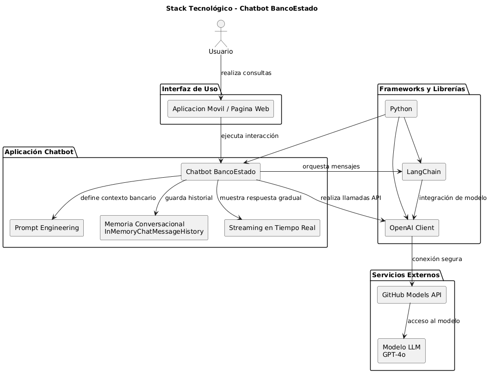

# Chatbot BancoEstado - Informe del Proyecto 

## 1. Introducción

En el contexto actual de transformación digital, las instituciones financieras enfrentan el desafío de mejorar la atención al cliente mediante soluciones eficientes, rápidas y disponibles en todo momento. En este escenario, el uso de inteligencia artificial, específicamente modelos de lenguaje (LLM), se presenta como una alternativa innovadora para automatizar la interacción con los usuarios.

El presente proyecto tiene como objetivo el desarrollo de un chatbot inteligente orientado a la atención de clientes de BancoEstado, capaz de responder consultas frecuentes relacionadas con:

- Creación de cuentas bancarias (CuentaRUT, cuenta de ahorro, cuenta vista)
- Bloqueo y gestión de tarjetas
- Transferencias bancarias
- Uso de servicios digitales

El sistema busca entregar respuestas claras, seguras y en tiempo real, mejorando la experiencia del usuario y optimizando los canales de atención.

Para ello, se integran tecnologías como GitHub Models API (GPT-4o), LangChain para orquestación de agentes, y un planificador offline con clasificación de intenciones por palabras clave.

---

## 2. Problemática

Las instituciones financieras presentan una alta demanda de consultas por parte de los usuarios, lo que genera sobrecarga en canales tradicionales como sucursales, call centers y plataformas digitales.

Esto provoca:
- Tiempos de espera elevados
- Saturación de los canales de atención
- Baja eficiencia en la resolución de consultas simples

Frente a esta problemática, surge la necesidad de implementar soluciones basadas en inteligencia artificial que permitan automatizar respuestas, mejorar la disponibilidad del servicio y optimizar la experiencia del usuario.

---

## 3. Implementación de la Solución

La solución fue desarrollada integrando distintas tecnologías abordadas durante el curso, inicialmente en notebooks separados, y posteriormente unificadas en una sola arquitectura funcional.

El sistema final corresponde a un chatbot inteligente capaz de mantener conversaciones, recordar contexto y responder consultas utilizando información relevante.

---

### 3.1 GitHub Models API

Se utilizó la API de GitHub Models para conectarse a modelos de lenguaje avanzados como GPT-4o.

Esto permitió:
- Generar respuestas dinámicas en tiempo real
- Configurar parámetros como temperatura y tokens
- Integrar inteligencia artificial mediante API

---

### 3.2 LangChain Model API

LangChain fue utilizado como framework para estructurar la interacción con el modelo, permitiendo:

- Manejo de mensajes estructurados (system, user, assistant)
- Conversaciones multi-turno
- Integración de memoria conversacional
- Arquitectura modular y escalable

---

---

### 3.4 Memoria Conversacional

Se utilizaron tres estrategias de memoria de LangChain: ConversationBufferMemory (historial completo), ConversationBufferWindowMemory (últimas 4 interacciones) y ConversationSummaryMemory (resumen automático vía LLM).

Esto permite:
- Recordar interacciones previas
- Responder de manera coherente
- Simular una conversación real

---

## 4. Prompt Engineering

Se aplicó la técnica de:

- Zero-shot prompting (definición de rol, reglas de negocio y comportamiento)

El prompt incluye:
- Rol del asistente
- Formato estructurado de respuesta
- Restricciones de seguridad
- Uso de contexto y memoria

Esto mejora significativamente la calidad de las respuestas.

---

## 5. Funcionalidades del Sistema

- Chat interactivo en consola y frontend web
- 15 herramientas bancarias (13 simuladas + 2 reales: Wikipedia, fecha/hora)
- Memoria conversacional (3 estrategias: buffer, window, summary)
- Uso de modelo GPT-4o via GitHub Models API
- Planificador offline con clasificación por palabras clave y 14 intenciones
- Orquestador multi-paso con dependencias y criticidad
- Toma de decisiones adaptativa (evaluación de riesgo en transferencias y créditos)
- Envío de reportes de sesión por correo SMTP
- Frontend web conectado a backend Flask

---

## Diagrama del Sistema

  

---

## 11. Consideraciones

- El sistema no solicita datos sensibles  
- Las respuestas son informativas  
- Se recomienda el uso de canales oficiales  
- Se identificaron limitaciones en el uso combinado de few-shot y memoria  

---

## 12. Conclusión

El chatbot desarrollado integra GPT-4o mediante GitHub Models API, LangChain para orquestación de agentes con function calling, y un planificador offline con clasificación de intenciones, logrando un sistema conversacional funcional.

El sistema responde consultas bancarias usando herramientas simuladas, mantiene contexto conversacional mediante memoria y evalúa riesgos en operaciones como transferencias y créditos. La principal limitación es que la API bancaria es simulada (BancoEstado es un sistema cerrado), por lo que los datos de clientes, saldos y transacciones son ficticios.

En conclusión, el proyecto logra cumplir los objetivos propuestos, ofreciendo una solución eficiente, escalable y alineada con las necesidades actuales de atención al cliente en el ámbito financiero.

---

## Autores 

- Luciano Garrido  
- Isidora Ayala
